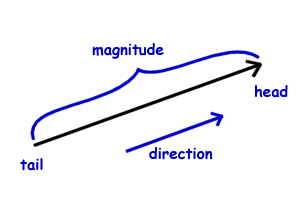

<h1 align="center">
  Chapter 01 - Vectors
</h1>

This chapter is about vector and your attributes. The vector spoken here is a **Euclidean vector** (known as a geometric vector). A vector is typically drawn as an arrow, from one point an another, composed by a direction, for where is pointing and a magnitude, your size or the distance between your extremities.

  

## Example 1 - [Star](./star)

## Example 2 - [Walker](./walker)

## Example 3 - [Mover](./mover)

