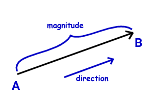
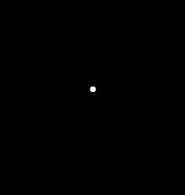
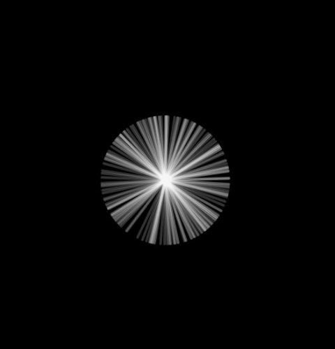
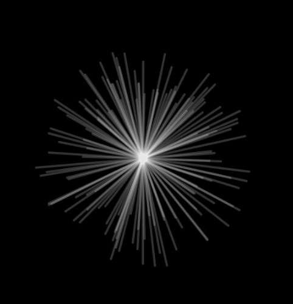

<h1 align="center">
  Chapter 01 - Vectors
</h1>

This chapter is about vector and your attributes. The vector spoken here is a **Euclidean vector** (known as a geometric vector). A vector is typically drawn as an arrow, from one point an another, composed by a direction, for where is pointing and a magnitude, your size or the distance between your extremities.

<p align="center">
  
</p>

## Operations

## Example 1 - [Star](./star)
`p5.js` provide a static method to generate 2D vectors with the same magnitude unitary(equal to one) but with random direction. We can see below.

```js
  const vetor = p5.Vector.random2D();
```

For draw the vector on canvas
```js
  strokeWeight(4);
  stroke(255, 50);
  line(0, 0, vetor.x, vetor.y);
```

The result is... one point

<p align="center">
  
</p>

That is because is are unit vectors, the magnitude is one. What happens if scale the vector by `X` value before draw on canvas? for example 100.

```js
  vetor.mult(100);
```

The result is... one star :sparkles: but uniform

<p align="center">
  
</p>


We can make things more interesting by scale the vector by a random value between 100 and 200.

```js
  vetor.mult(random(100, 200));
```

this final result is... one star :sparkles: or fireworks, I don't know, let your imagination decide.

<p align="center">
  
</p>

## Example 2 - [Walker](./walker)


## Example 3 - [Mover](./mover)

